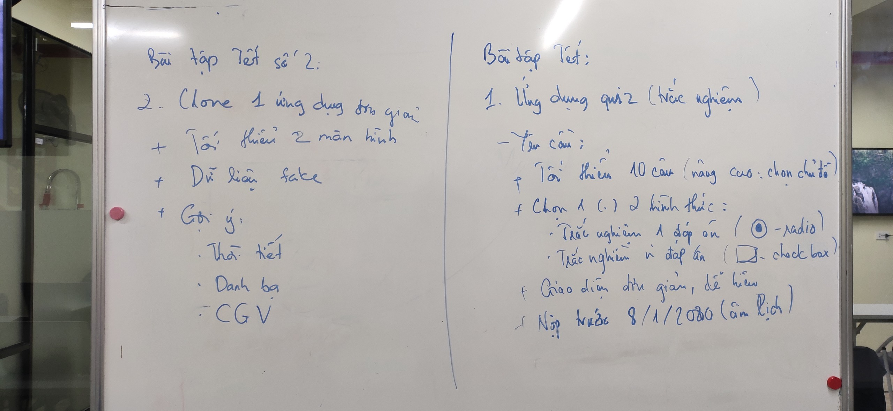

# Bài tập Tết




# Yêu cầu
    - Bài tập đẩy lên Github, gửi link bài tập qua Mail
    - Cú pháp gửi bài:
        [Bài tập Tết] + Họ tên người gửi + lớp di động 3
    - Gửi bài tập vào mail: quynh@techmaster.vn
    - Khuyến khích viết README.md mô tả repository của mình

## Nội dung đã học
- Ôn tập, hệ thống lại các nội dung đã học

## Lưu ý

```
import Foundation

print("Chúc mừng năm mới 2020 - Canh Tý")

```


