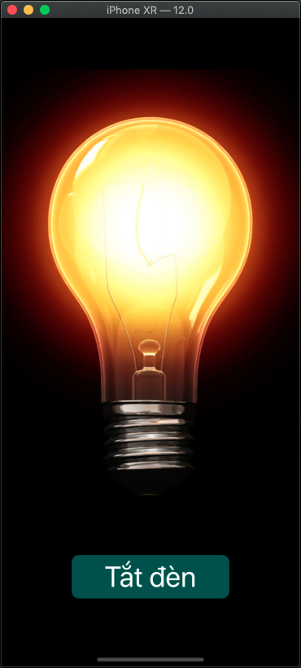
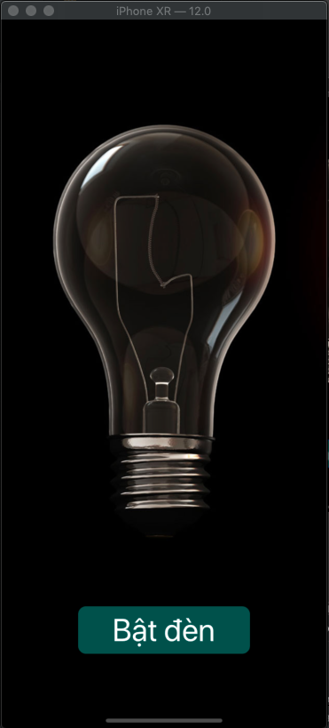

# Buổi 5

# Bài tập về nhà
1, Vẽ hình chữ nhật đặc:
```
* * * * * * *
* * * * * * *
* * * * * * *
* * * * * * *
```

2, Vẽ hình chữ nhật rỗng:
```
* * * * * * *
*           *
*           *
* * * * * * *
```

3,  Vẽ tam giác vuông:
```
*
* *
* * * 
* * * *
* * * * *
```

4, Vẽ tam giác cân ngược:
```
* * * * * * *
  * * * * *
    * * *
      *
```
5, Hai anh em nhà cừu không có gì chơi, thằng anh mới đố thằng em: “Tao cho mày 1 số, nếu nó chẵn thì chia đôi, nó lẻ thì nhân 3 cộng 1. Đố mày biết sau bao nhiêu phép tính thì nó ra 1 ???”. 
Ông em ngẩn tò te không biết trả lời như nào. Bạn hãy giúp chú bé 1 tay với. In ra đáp án hoặc “-1” nếu ko có số nào hợp lệ.

6, [Bài tập ôn giao diện] 
- Tạo một UIButton và một UILabel
- Xử lý khi nhấn vào UIButton thì random ra một số tự nhiên và cập nhật vào UI

Hướng dẫn:
- Random một số nguyên
```
VD: let number = Int.random(in: 1...100) // nghĩa là random các số trong khoảng từ 1 đến 100
```
- Cập nhật UILabel
```
VD: có biến numberLabel đại diện cho đối tượng UILabel
numberLabel.text = "1" // cập nhật text cho UILabel
```

## Lưu ý


# Yêu cầu
    - Bài tập đẩy lên Github, gửi link bài tập qua Mail
    - Cú pháp gửi bài:
        [BTVN-05] + Họ tên người gửi + lớp di động 3
    - Gửi bài tập vào mail: quynh@techmaster.vn, cc mail cho thầy cuong@techmaster.vn
    - Khuyến khích viết README.md mô tả repository của mình

## Nội dung đã học

### Chữa bài tập về nhà buổi 4

```
// 1. Sắp xếp mảng 
func sapXepMang(){
    var array = [2, 9, 1, 38, 39, 38]
    print("Mảng ban đầu: \(array)")
    
    var temp = 0
    for i in 0..<array.count-1{
        print(array[i])
        for j in i+1..<array.count{
            if array[i] > array[j] {
                temp = array[i]
                array[i] = array[j]
                array[j] = temp
            }
            print("i: \(i) - j: \(j) => \(array)")
        }
    }
    print("Mảng sau khi sắp xếp tăng dần: \(array)")
    print("Mảng sau khi sắp xếp giảm dần: \(array.reversed())")
    
}

----------------
// Bài 2:
func timSoLonThu2(){
    print("Nhập số nguyên dương nhỏ hơn 10000")
    var n = Int(readLine()!)
    while n < 0 || n > 10000 {
        n = input(mutA: 0, mutB: 10000)
    }
    
    var numberArray = [Int]()
    var x = 0
    var newArray = [Int]()
    
    // Tách rời các chữ số của n
    while n > 0 {
        x = n % 10
        n = n / 10
        numberArray += [x]
    }
    
    // Loại bỏ các các phần tử trùng nhau
    newArray = Array(Set(numberArray))
    
    // Sắp xếp mảng
    newArray.sort()
    
    // Nếu n là số có 1 chữ số thì in ra số lớn nhất
    // Nếu n là số có 2 chữ số trở lên thì in ra số lớn thứ 2
    if newArray.count == 1 {
        print("Chữ số lớn nhất là: \(newArray[0])")
    }else{
        print(newArray)
        print("Chữ số lớn thứ 2 là: \(newArray[newArray.count - 2])")
    }
}

----------------
// Bài 3:
func timUoc() {
    print("Nhập số tự nhiên:")
    let number = Int(readLine()!)!
    if number < 0 {
        print("\(number) không phải số tự nhiên")
    } else if number == 0 {
        print("0 có vô số ước số!")
    } else {
        var numbers: [Int] = []
        for i in 1...(Int(number / 2)) {
            if number % i == 0 {
                numbers.append(i)
            }
        }
        numbers.append(number)
        print("\(number) có tập hợp ước số: \(numbers)")
    }
}

----------------
// bài 4
// in họ tên
func hoTen(){
    print("Nhập đầy đủ họ tên: ")
    let string = String(readLine()!)
    
    print(string)
    var hoTen = string.components(separatedBy: " ")
    print(hoTen)
    
    if hoTen.count == 1 {
        print("\(hoTen[0])")
    } else if hoTen.count == 2 {
        print("\(hoTen[0]) \(hoTen[1])")
    } else {
        let ho = hoTen.removeFirst()
        let ten = hoTen.removeLast()
        print(hoTen)
        print("\(ho) \(ten)")
    }
}

----------------
// Bài 5: 
func chonDapAn(){
    print("""
    Đâu không phải là một ngôn ngữ lập trình:
    a. Golang
    b. Swift
    c. Ruby
    d. Daily
""")
    let select = readLine()!
    switch select{
    case "a":
        print("Đáp án sai")
    case "b":
        print("Đáp án sai")
    case "c":
        print("Đáp án sai")
    case "d":
        print("Đáp án đúng")
    default:
        print("Đáp án không hợp lệ!")
        
    }
}

----------------
// Bài 6:
func soHoanHao() {
    
    print("Nhập số: ")
    let n = Int(readLine()!)!
    
    while n < 2 || n > 32767 {
        soHoanHao()
    }
    
    for i in 6...n {
        if isSoHoanHao(i) {
            print("\(i)")
        }
    }
}

// hàm kiểm tra một số phải số hoàn hảo hay không
func isSoHoanHao(_ n: Int) -> Bool {
    var sum = 0
    for i in 1...n/2 {
        // tính tổng các ước
        if n % i == 0 {
            sum += i
        }
    }
    
//    if sum == n {
//        return true
//    } else {
//        return false
//    }
    
    return sum == n
}


```
## Bài tập đã làm trên lớp

### Bài tập Bật tắt đèn
<table>
<td>
  
</td>
<td>
  
</td>
</tr>
</table>

### Bài tập IAmRich


