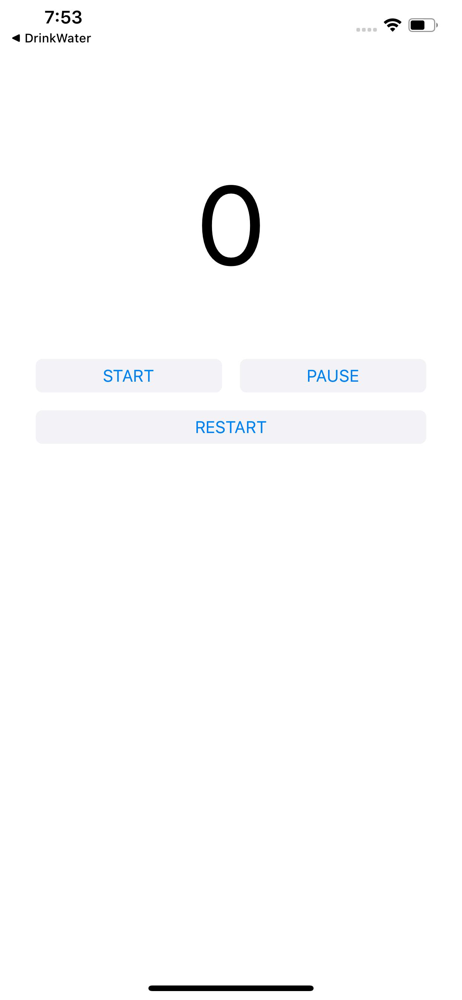
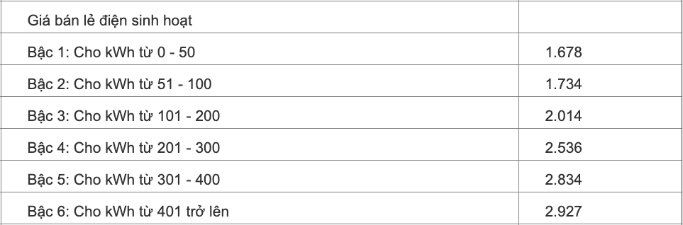

# Buổi 7

# Bài tập về nhà
1. Đếm số nguyên tố trong đoạn [a, b]
2. Hiển thị số ngày của tháng. Với tháng 2 có 29 ngày nếu là năm nhuận, 28 ngày nếu là năm không nhuận.
3. Viết ứng dụng timer


4. Viết ứng dụng tính tiền điện (dựa theo số điện và đơn giá theo quy định của Nhà nước). Giao diện tự nghĩ.


5. Chèn phần tử có giá trị X vào phía sau phần tử có giá trị lớn nhất trong mảng.

6. Chèn phần tử có giá trị X vào mảng sao cho mảng vẫn có thứ tự tăng dần.

## Lưu ý
    
# Yêu cầu
    - Bài tập đẩy lên Github, gửi link bài tập qua Mail
    - Cú pháp gửi bài:
        [BTVN-07] + Họ tên người gửi + lớp di động 3
    - Gửi bài tập vào mail: quynh@techmaster.vn, cc mail cho thầy cuong@techmaster.vn
    - Khuyến khích viết README.md mô tả repository của mình

## Nội dung đã học
- Làm việc với timer
- Thay đổi toạ độ frame của UIView
- Sử dụng thư viện AVFoudation để chạy âm thanh
- UISlider
    
## Bài tập đã làm
    
### Chữa bài tập về nhà:

```
// tính tổng các chữ số của một số
func tongCacChuSo(){
    print("Nhap vao mot so: ")
    let number = Int(readLine()!)!
    var fnumber = number
    var sum = 0
    repeat {
        sum += fnumber % 10
        fnumber /= 10
    }while(fnumber > 10)
    sum += fnumber
    print("tong cua so \(number) = \(sum)")
}

// kiểm tra số có phải là số đối xứng
func soDoiXung(){
    print("So doi xung")
    
    var num = Int(readLine()!)!
    var arr:[Int] = []
    while num > 0
    {
        arr.append(num%10)
        num /= 10
    }
    var i = 0
    var j = arr.count - 1
    while i < j
    {
        if(arr[i] == arr[j])
        {
            i += 1
            j -= 1
        }
        else
        {
            print("Khong phai so doi xung")
            break
        }
    }
    if i == j || i > j
    {
        print("La so doi xung")
        
    }
}

// giải phương trình bậc 2
func ptBacHai(){
    print("Giai phuong trinh: ax2 + bx + c = 0")
    
    print("Nhap so a")
    
    func timX () {
        let a = Float(readLine()!)!
        if a == 0 {
            print("Nhap lai")
            return timX()
        }
        print("Nhap 2 so b va c")
        let b = Float(readLine()!)!
        let c = Float(readLine()!)!
        let delta = powf(b, 2) - 4*a*c
        if delta < 0 {
            print("Phuong trinh vo nghiem")
        }
        else if delta == 0 {
            print("Phuong trinh co nghiem duy nhat la: \(-b/2*a)")
        } else {
            print("Phuong trinh co hai nghiem la: \(-b-sqrtf(delta)/2*a) va \(-b+sqrtf(delta)/2*a)")
        }
    }
}

// tính cước taxi:
– Km đầu tiên là 5000đ
– 30Km tiếp theo là 4000đ
– Nếu lớn hơn 30Km thì mỗi Km thêm ra sẽ phải trả là 3000đ
– Hãy nhập số Km sau đó in ra số tiền phải trả.

func cuocTaxi(){
    print("nhap so km: ")
    var km = Float(readLine()!)!
    if (km<0){
        print ("nhap sai")
        return cuocTaxi()
    }
    if km <= 1 {
        print("so tien = 5000")
    }
    else if km <= 31 {
        print ("so tien = \(5000 + (km-1)*4000)")
    }
    else if km>31 {
        print ("so tien = \(5000 + 4000*30 + 3000*(km-31))")
    }
}

```

### Bài làm tại lớp
- Ứng dụng drink water
- Demo Slider thay đổi kích thước, rotate, radius của UIView

