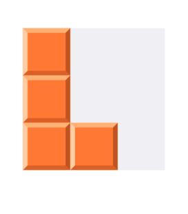

# Buổi 2

# Bài tập về nhà
1. Dùng CALayer để vẽ viên gạch:

    
## Lưu ý
- Keyword: layer, subLayer, CAShapeLayer, UIBerizePath

# Yêu cầu
    - Bài tập đẩy lên Github, gửi link bài tập qua Mail
    - Cú pháp gửi bài:
        [BTVN-09] + Họ tên người gửi + lớp di động 3
    - Gửi bài tập vào mail: quynh@techmaster.vn, cc mail cho thầy cuong@techmaster.vn
    - Khuyến khích viết README.md mô tả repository của mình

## Nội dung đã học
- Học một số thuộc tính của UIView: clipToBounds, layer
- Học một số thuộc tính của layer: maskToBounds, radius, opacity, shadow
    
## Chữa bài tập về nhà buổi 8
```
func mangGiamDan(){
    var arrays: [Int] = [3, 19, -4, 0, 84]
    arrays.sort() // sắp xếp tăng dần
    
    arrays.sort { (i: Int, j: Int) -> Bool in
        return i >= j // i>=j: sắp xếp giảm dần, i < j: sắp xếp tăng dần
    }
    
    print(arrays)
}

func veHinhKhan(){
    print("Nhập vào số h: ")
    let h = Int(readLine()!)!
    
    for i in 0...h{
        if i < h/2{
            for _ in 0...i{
                print("*", terminator: "")
            }
            print()
        }
        
        if i > h/2{
            for _ in i...h{
                print("*", terminator: "")
            }
            print()
        }
    }
}

func veHinhThoi(){
    print("Nhập vào số h (h lẻ và h > 3): ")
    let h = Int(readLine()!)!
    if h%2 == 0 || h < 3{
        veHinhThoi()
        return
    }
    let n = h/2+1
    var range = 0
    for i in 1...h{
        for j in 1...h{
            if j >= n - range && j <= n + range{
                print("*", terminator: "")
            }else{
                print(" ", terminator: "")
            }
            
        }
        if i >= n {
            range -= 1
        }else{
            range += 1
        }
        print()
    }
    veHinhThoi()
}

// kiểm tra một số có phải là số Amstrong không?
func soAmstrong(){
    print("Hãy nhập vào số tự nhiên nhỏ hơn 1000:")
    let n = readLine()!
    
    if Int(n)! >= 1000 || Int(n)! <= 0{
        soAmstrong()
        return
    }
    
    let arr = Array(n)
    var numbers = [Float]()
    
    numbers = arr.map { (i: Character) -> (Float) in
        Float(String(i))!
    }
    
    var tongArm: Float = 0
    for i in numbers{
        tongArm += powf(i, Float(numbers.count))
    }
    
    if Float(n)! == tongArm {
        print("\(n) là số Armstrong")
    }else{
        print("\(n) không phải là số Armstrong")
    }
    
    soAmstrong()
}

func baiNgayThangNam(){
    func validate(day: Int, month: Int, year: Int) -> Bool{
        if year < 1 || year > 9999 || month < 1 || month > 12 || day < 1 || day > 31{
            return false
        }
        
        if day > getTotalDayInMonth(month: month, year: year){
            return false
        }
        
        return true
    }
    
    func getTotalDayInMonth(month: Int, year: Int) -> Int{
        switch month {
        case 1, 3, 5, 7, 8, 10, 12:
            return 31
        case 4, 6, 9, 11:
            return 30
        case 2:
            if isLeapYear(year: year){
                return 29
            }else{
                return 28
            }
        default:
            return 0
        }
    }
    
    func isLeapYear(year: Int) -> Bool {
        if (year % 4 == 0 && year != 100) || year % 400 == 0{
            return true
        }else{
            return false
        }
    }
    
    func calendar(){
        var year, month, day : Int!
        repeat {
            print("------")
            print("Nhập ngày: ", terminator: "")
            day = Int(readLine()!)!
            print("Nhập tháng: ", terminator: "")
            month = Int(readLine()!)!
            print("Nhập năm: ", terminator: "")
            year = Int(readLine()!)!
        } while (!validate(day: day, month: month, year: year))
        
        print("Tổng số ngày của tháng \(month!) là \(getTotalDayInMonth(month: month, year: year))")
        print(findDate(day, month, year).0)
        print(findDate(day, month, year).1)
        calendar()
    }
    
    func findDate(_ day: Int, _ month: Int, _ year: Int) -> (String, String){
        let totalDayInMonth = getTotalDayInMonth(month: month, year: year)
        
        if day == 1 {
            if month == 1 {
                return ("Ngày liền trước: \(getTotalDayInMonth(month: 12, year: year-1))/12/\(year - 1)", "Ngày liền sau: \(2)/\(month)/\(year)")
            }else{
                return ("Ngày liền trước: \(getTotalDayInMonth(month: month-1, year: year))/\(month)/\(year)", "Ngày liền sau: \(2)/\(month)/\(year)")
            }
        } else if day == totalDayInMonth {
            if month == 12 {
                return ("Ngày liền trước: \(getTotalDayInMonth(month: 12, year: year) - 1)/12/\(year)", "Ngày liền sau: \(1)/\(1)/\(year+1)")
            }else{
                return ("Ngày liền trước: \(totalDayInMonth-1)/\(month)/\(year)", "Ngày liền sau: \(1)/\(month+1)/\(year)")
            }
        } else{
            return ("Ngày liền trước: \(day-1)/\(month)/\(year)", "Ngày liền sau: \(day+1)/\(month)/\(year)")
        }
    }
    calendar()
}

```


