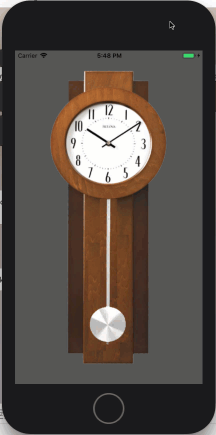
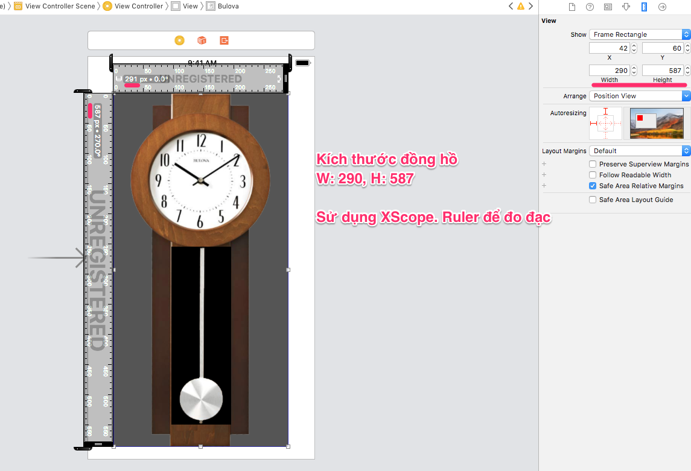
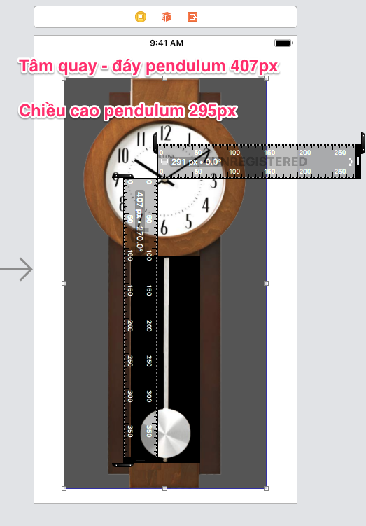

# Đồng hồ con lắc Bulova

Ứng dụng này giúp chúng ta hiểu rõ về UIView.center và UIView.anchorpoint
[Tham khảo bài viết này có minh họa rất tốt](https://apprize.info/apple/ios_5/4.html)

Mọi việc lập trình giao diện cần phải được đo đạc chính xác thì code mới nhanh, không code hú họa nhé. Ở đây mình sử dụng XScope measure tool để đo.

1. Kích thước đồng hồ Bulova {width: 280, height: 587}
2. Kích thước pendulum {width: 99, height: 295}
3. Khoảng cách từ tâm quay kim đồng hồ đến đáy pendulum 407}
4. Khoảng cách từ đỉnh bulova đến tâm quay là 145
5. Khoảng cách từ cạnh trái bulova đến tâm quay là 143

Mục tiêu hãy lập trình để pendulum có tâm quay trùng vào đúng tâm quay kim đồng hồ Bulova

Thứ tự phân cấp các UIView trong ứng dụng này
1. ViewControler.view chứa bulova (UIImageView)
2. bulova chứa pendulum. pendulum sẽ đung đưa bên trong khung nhìn của bulova như vậy sẽ hợp logic vật lý thực tế, cấu trúc máy móc hơn

**Làm để con lắc quay xung quanh đồng trục với tâm quay kim đồng hồ?**

Để con lắc xoay quanh tâm quay của kim đồng hồ, chúng ta phải đổi anchorPoint của con lắc từ giá trị
mặc định CGPoint(0.5, 0.5), đển tâm quay của kim đồng hồ.

Tâm quay của kim cách đỉnh (top) của ảnh con lắc là 255 - 145.
255 là khoảng cách từ đỉnh bulova đến con lắc
145 là khoảng cách từ đỉnh bulova đến tâm quay
295 là chiều cao của con lắc.
Tâm quay nếu tính theo trục y thì nằm bên trái gốc tọa độ do đó anchorPoint theo hướng trục y là
- (255-145)/295
anchorPoint theo hướng trục x vẫn nằm chính giữa do đó giữ nguyên.

Khi ta chuyển anchorPoint của con lắc trùng với tâm quay kim đồng hồ, thì việc đặt con lắc nên sử dụng thuộc
tính center của nó. Lúc này điểm center của con lắc cũng chính là tọa độ của tâm quay
