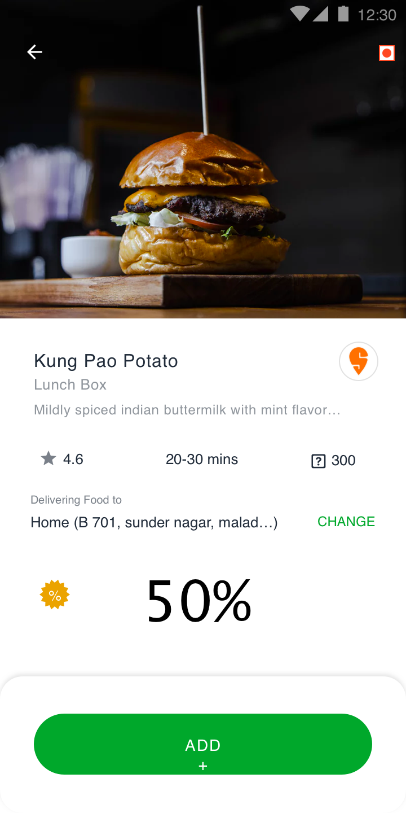

# Buổi 19

# Bài tập về nhà
1. Layout bằng code các màn hình sau
> <table>
> <tr>
> <p>- Login:</p>
>  </tr>
>   <tr>
>   
>   </tr>
>   <tr>
>   <p>- Detail:</p>
>    </tr>
>   <tr>
>     
>   </tr>
> </table>

# Yêu cầu
    - Bài tập đẩy lên Github, gửi link bài tập qua Mail
    - Cú pháp gửi bài:
        [BTVN-19] + Họ tên người gửi + lớp di động 3
    - Gửi bài tập vào mail: quynh@techmaster.vn, cc mail cho thầy cuong@techmaster.vn
    - Khuyến khích viết README.md mô tả repository của mình

## Nội dung đã học
- Học các auto layout giao diện bằng code, sử dụng NSLayoutConstraint
- Khi sử dụng AutoLayout bằng code, phải set thuộc tính translatesAutoresizingMaskIntoConstraints = false
```
myView.translatesAutoresizingMaskIntoConstraints = false
```
- Layout top:  ```topAnchor```
- Layout left:  ```leftAnchor, leadingAnchor```
- Layout right:  ```rightAnchor, trailingAnchor```
- Layout bottom:  ```bottomAnchor```
- Layout width:  ```widthAnchor```
- Layout height: ```heightAnchor```
- Layout căn trục: ```centerXAnchor, centerYAnchor```

- Cách 1:
```
scrollView.topAnchor.constraint(equalTo: view.topAnchor, constant: 0).isActive = true
scrollView.leadingAnchor.constraint(equalTo: view.leadingAnchor, constant: 0).isActive = true
scrollView.trailingAnchor.constraint(equalTo: view.trailingAnchor, constant: 0).isActive = true
scrollView.bottomAnchor.constraint(equalTo: view.bottomAnchor, constant: 0).isActive = true
```
- Cách 2:
```
let constraintBlueView = [
    blueView.topAnchor.constraint(equalTo: brownView.topAnchor, constant: 64),
    blueView.leadingAnchor.constraint(equalTo: brownView.leadingAnchor, constant: 64),
    blueView.trailingAnchor.constraint(equalTo: brownView.trailingAnchor, constant: -64),
    blueView.heightAnchor.constraint(equalToConstant: 40)
]

NSLayoutConstraint.activate(constraintBlueView)
```
## Lưu ý

