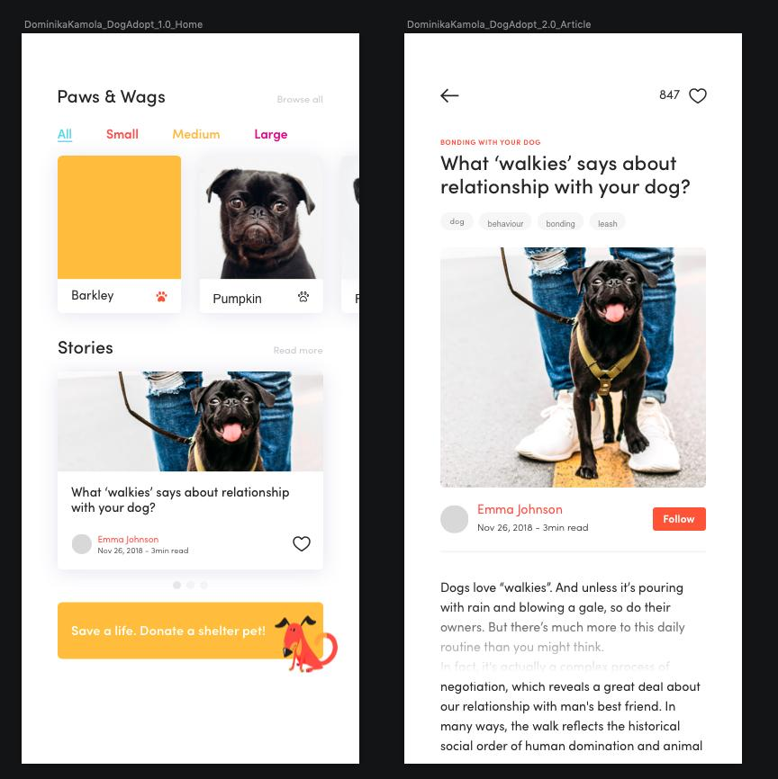

# Buổi 20

# Bài tập về nhà
1. Layout bằng code các màn hình sau
> <table>
>   <tr>
>   
>   </tr>
> </table>

# Yêu cầu
    - Bài tập đẩy lên Github, gửi link bài tập qua Mail
    - Cú pháp gửi bài:
        [BTVN-20] + Họ tên người gửi + lớp di động 3
    - Gửi bài tập vào mail: quynh@techmaster.vn
    - Khuyến khích viết README.md mô tả repository của mình

## Lưu ý

