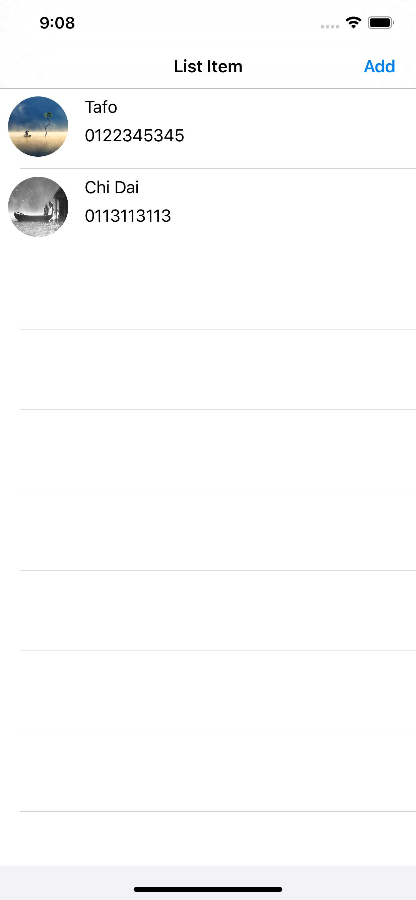
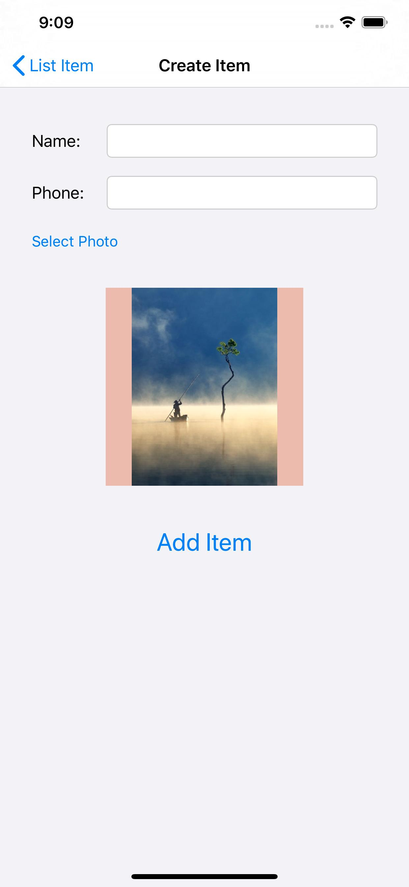

# Buổi 24

# Bài tập về nhà
1. Ôn tập TableView
2. Viết ứng dụng Todo List
- Giao diện gợi ý:

# Yêu cầu
    - Bài tập đẩy lên Github, gửi link bài tập qua Mail
    - Cú pháp gửi bài:
        [BTVN-24] + Họ tên người gửi + lớp di động 3
    - Gửi bài tập vào mail: quynh@techmaster.vn
    - Khuyến khích viết README.md mô tả repository của mình

## Nội dung đã học
- CustomCell, đổ data, edit cell, select cell

## Lưu ý

