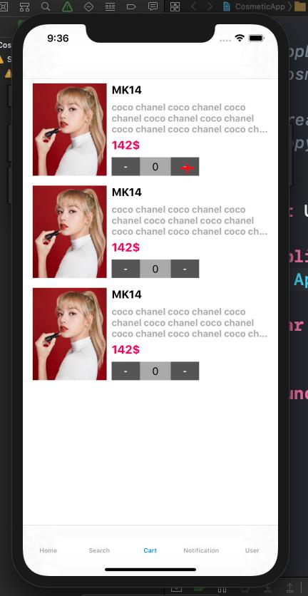

# Buổi 25

# Bài tập về nhà
1. Viết giao diện sử dụng tableView

2. Ôn tập truyền dữ liệu bằng closure
3. Ôn tập lấy ảnh từ thư viện, camera sử dụng ImagePicker

# Yêu cầu
    - Bài tập đẩy lên Github, gửi link bài tập qua Mail
    - Cú pháp gửi bài:
        [BTVN-25] + Họ tên người gửi + lớp di động 3
    - Gửi bài tập vào mail: quynh@techmaster.vn
    - Khuyến khích viết README.md mô tả repository của mình

## Nội dung đã học
- Sử dụng UIImagePickerController để lấy ảnh

## Lưu ý

