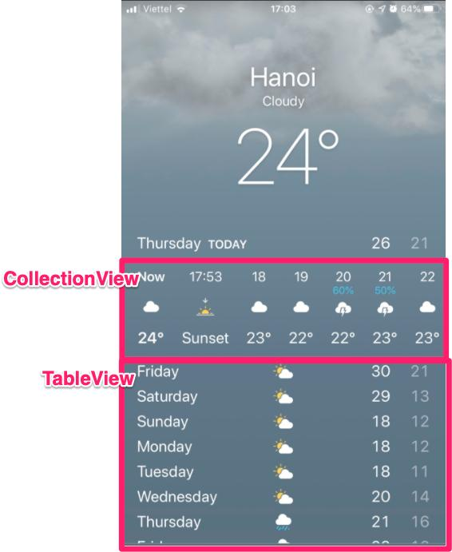

# Buổi 30

# Kiểm tra
- Viết ứng dụng thời tiết
- Sử dụng các kiến thức đã học
- Control chủ yếu: UIView, UITableView, UICollectionView, UILable
- Sử dụng struct, class

## Lưu ý

# Yêu cầu
    - Bài tập đẩy lên Github, gửi link bài tập qua Mail
    - Cú pháp gửi bài:
        [BTVN-29] + Họ tên người gửi + lớp di động 3
    - Gửi bài tập vào mail: quynh@techmaster.vn
    - Khuyến khích viết README.md mô tả repository của mình

## Nội dung

